## LULZGIF

Where I store and link to all my reaction GIFs.

Browse the collection at [gif.kbr.sh](https://gif.kbr.sh).

### Usage

Link directly to any GIF:

```
https://raw.githubusercontent.com/program247365/lulzgif/master/static/crazypills_zoolander.gif
```

### Adding GIFs

Add GIF files to the `static/` directory, then regenerate the table:

```bash
python3 scripts/generate_gif_table.py
```

## GIF Collection

| Name | Preview |
|------|:-------:|
| `Ship-It-ship` | 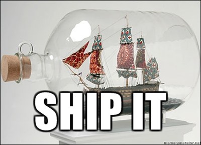 |
| `adult_juiceboxes` | 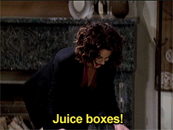 |
| `adulting` |  |
| `aliens` |  |
| `americanpolitics` |  |
| `amurica_dance` | 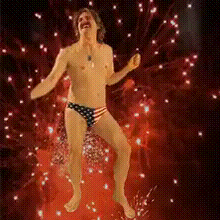 |
| `athleticability` | 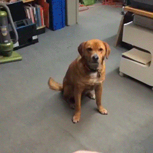 |
| `bacon` | 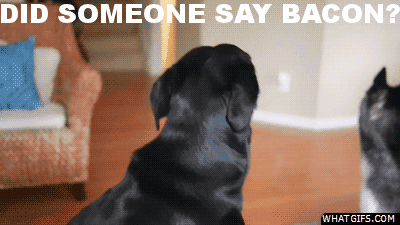 |
| `baconandeggs` | 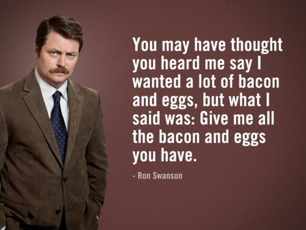 |
| `balanced-breakfast` | 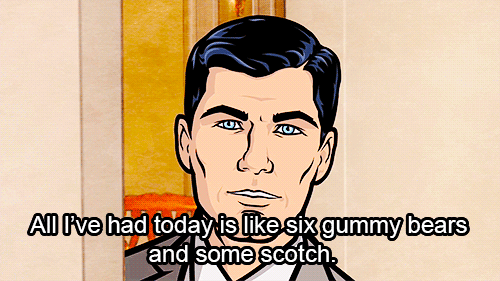 |
| `bam` | 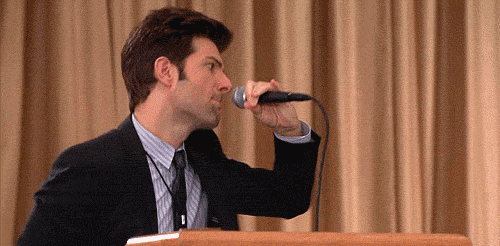 |
| `beardofzeus` | 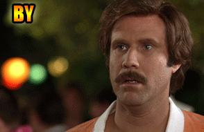 |
| `beavistype` | 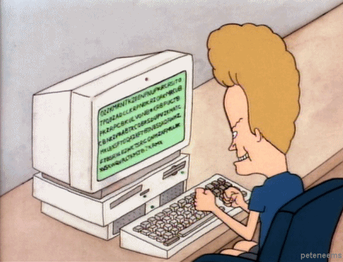 |
| `bestfriends_stepbros` |  |
| `beverage` | 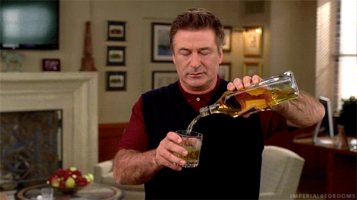 |
| `bohemian` | 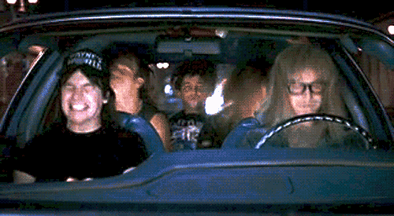 |
| `boogie-shoes` | 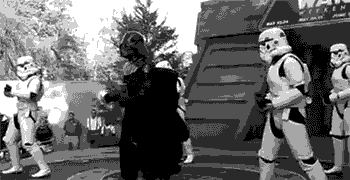 |
| `boop` | 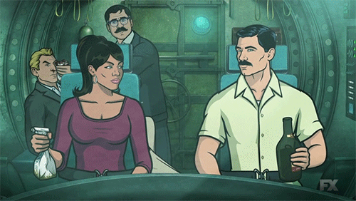 |
| `cade6` | 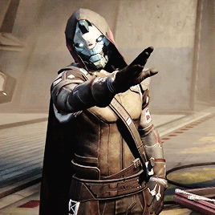 |
| `caffeine` | 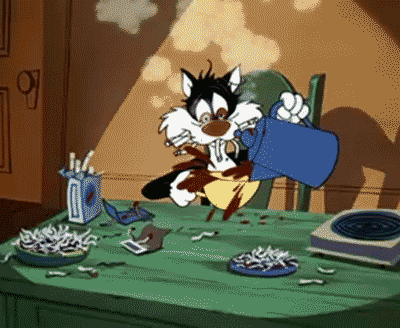 |
| `celaphonet` | 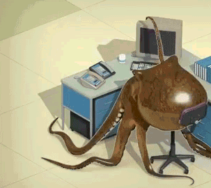 |
| `cheery-bye-now` | 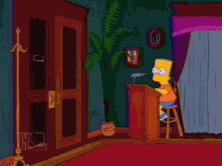 |
| `clevergirl` |  |
| `coffee` | 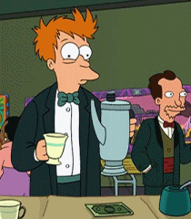 |
| `coffee_time` | 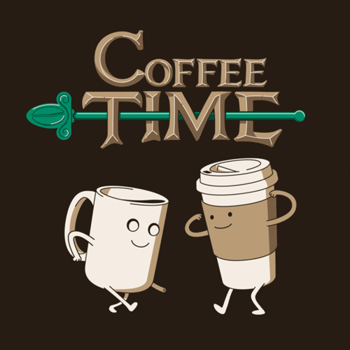 |
| `computering` | 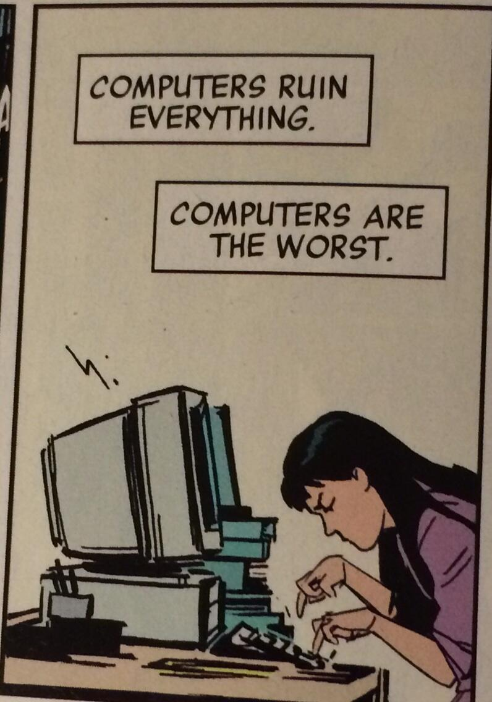 |
| `concur` | 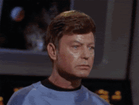 |
| `confused_ryan` | 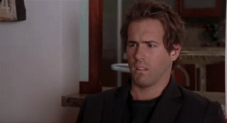 |
| `cookie-zomg` | 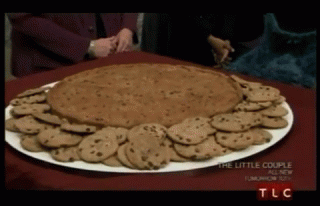 |
| `corgibounce` | 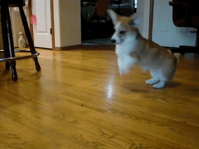 |
| `crazypills_zoolander` |  |
| `creepy_terrific` | 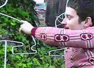 |
| `css_petergriffin` | 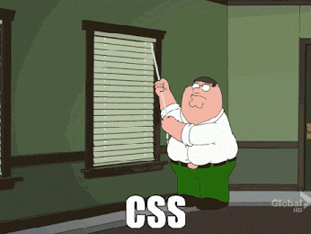 |
| `curling_cats` |  |
| `dance-party` | 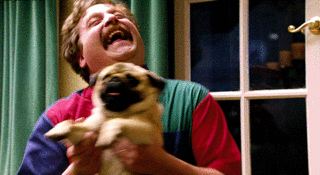 |
| `dance_freshprince` |  |
| `dance_freshprince_carlton` | 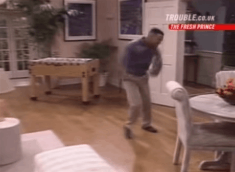 |
| `dance_readingrainbow` |  |
| `dance_sprockets` | 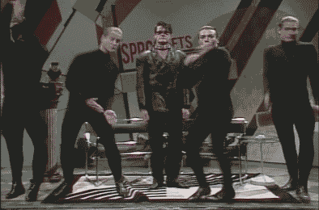 |
| `dance_theoffice` |  |
| `deal_owl` | 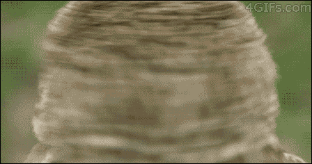 |
| `dealbreaker` |  |
| `dealwithit_dancing` | 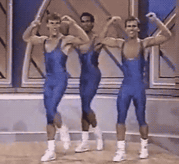 |
| `disappear_homer` | 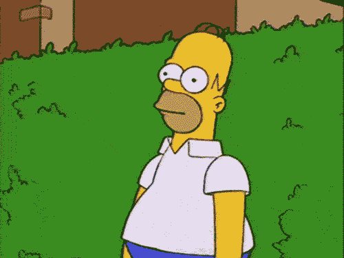 |
| `dollarbills_yall` | 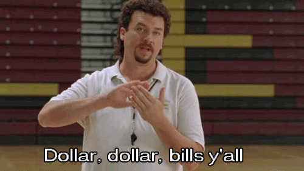 |
| `dopezebra` | 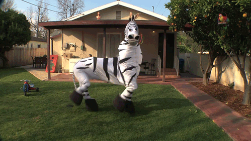 |
| `download_www` | 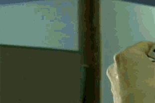 |
| `draperwah` | 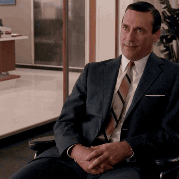 |
| `dropthebeat` | 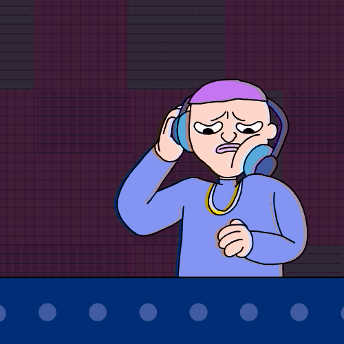 |
| `drunkswanson` | 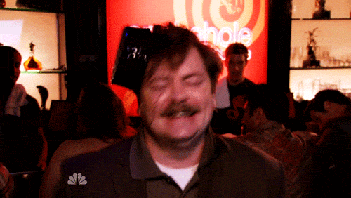 |
| `elf-lies` | 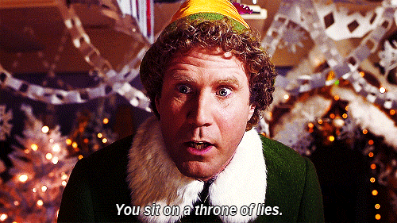 |
| `escalated_anchorman` | 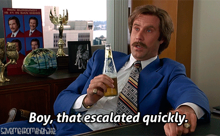 |
| `excellent` | 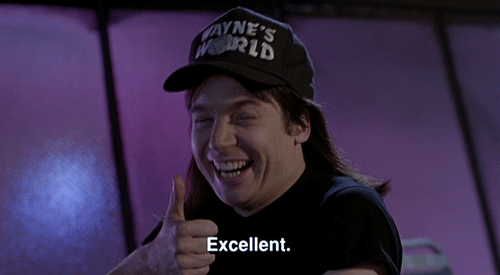 |
| `excited_jonah` |  |
| `excited_shaqcat` | 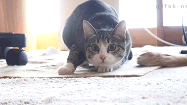 |
| `excitedpup` | 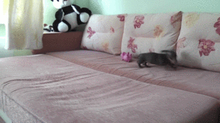 |
| `exercise-time` | 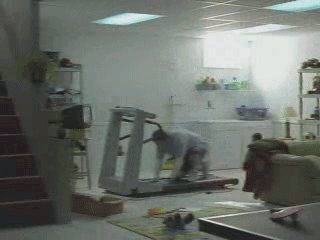 |
| `eyecontact` | 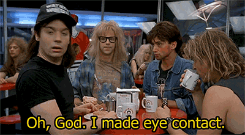 |
| `failure` | 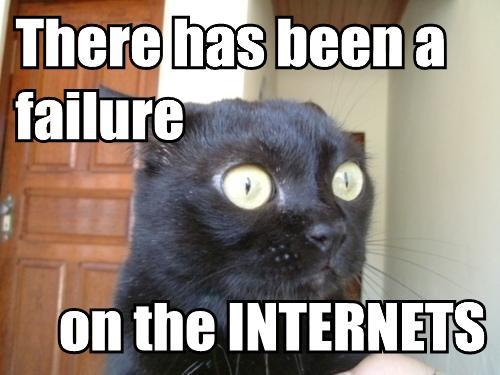 |
| `fargo-pissed` | 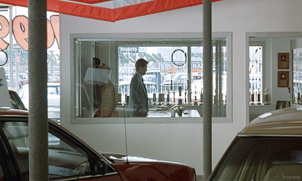 |
| `fascinated-sloth` | 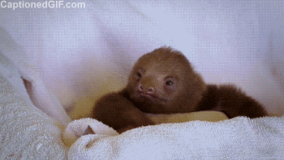 |
| `featherbottom` | 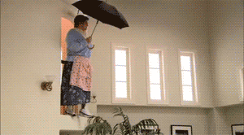 |
| `fire_theitcrowd` |  |
| `fishslap` |  |
| `five_blinks` |  |
| `fixingbugs` |  |
| `flappy` |  |
| `fozziefacepalm` |  |
| `frenchienerd` |  |
| `friday_freshprince` |  |
| `frustrated_oswald` |  |
| `frustrated_socialnetwork` |  |
| `fu-wliia` |  |
| `fuck-this-thing-cat` |  |
| `funny-pictures-cat-comes-from-internet` |  |
| `gentle-disagreement` |  |
| `getit_maplesyrup` |  |
| `godspeedmooncat` |  |
| `godspeedspacedog` |  |
| `goooold_goldmember` |  |
| `graceful-halt` |  |
| `greatjob` |  |
| `gsd` |  |
| `happy_antonio_banderas` |  |
| `happy_brad` |  |
| `hatersgonnahate_swift` |  |
| `helloweekend` |  |
| `high-five` |  |
| `holdontoyourbutts` |  |
| `homer_subscribed` |  |
| `hotdogkakke` |  |
| `howicomputer` |  |
| `impressed_zoolander` |  |
| `in-total-agreement` |  |
| `interesting` |  |
| `internet` |  |
| `its_happening` |  |
| `jackiecat` |  |
| `jerrypc` |  |
| `jesus` |  |
| `jif` |  |
| `jiff` |  |
| `jobs-deal` |  |
| `jonstewart_pewpew` |  |
| `jump` |  |
| `kaneclap` |  |
| `kramer-mind-blown` |  |
| `lebowski` |  |
| `lefthangin` |  |
| `lightbulb` |  |
| `livesite` |  |
| `looks_zoolander` |  |
| `loooove_it` |  |
| `luvu` |  |
| `magic_shia` |  |
| `makeitrain_parksandrec` |  |
| `makeitrain_siliconvalley` |  |
| `management` |  |
| `maru_box` |  |
| `matrix_wtf` |  |
| `medal` |  |
| `meter copy` |  |
| `meter` |  |
| `metric` |  |
| `milk` |  |
| `mine` |  |
| `mny` |  |
| `mobile` |  |
| `moneyfight` |  |
| `nangnangnang` |  |
| `nasafuckyeah` |  |
| `nerd_rage` |  |
| `no god no` |  |
| `noidea-bar` |  |
| `noidea-chemistry` |  |
| `noidea` |  |
| `noideadonkey` |  |
| `nonono` |  |
| `noooooo` |  |
| `notthattheresanythingwrongwiththat` |  |
| `obv` |  |
| `ogre` |  |
| `ohsnap_parksandrec` |  |
| `oprahdeal` |  |
| `oregon` |  |
| `over` |  |
| `pancake-bunny` |  |
| `panda` |  |
| `parksdrink` |  |
| `parkspop` |  |
| `party` |  |
| `permit` |  |
| `phone_freaksandgeeks` |  |
| `pivot` |  |
| `pizzatime` |  |
| `plan` |  |
| `please_cat` |  |
| `please_dog` |  |
| `popcorn` |  |
| `positive-thinking` |  |
| `production` |  |
| `productive` |  |
| `programming` |  |
| `pussnboots_bigeyes` |  |
| `regret` |  |
| `regretchan` |  |
| `rimshot` |  |
| `sad_uglycry` |  |
| `say_whaaat` |  |
| `scorpiofire` |  |
| `scottno` |  |
| `selffive_30rock` |  |
| `send_tom` |  |
| `ship it squirrel` |  |
| `ship_it_closeup` |  |
| `shipemralph` |  |
| `shipit_omg_no_revert` |  |
| `shipship` |  |
| `shipwolf` |  |
| `shovelmad` |  |
| `slowsmile_sloth` |  |
| `smash` |  |
| `smokebomb` |  |
| `snacking` |  |
| `spittake` |  |
| `spockminds` |  |
| `squirrel` |  |
| `succeed` |  |
| `success` |  |
| `success` |  |
| `suckerpunch` |  |
| `suckingwill` |  |
| `superfancy` |  |
| `surprised_bigeyes` |  |
| `sweet_babyjesus` |  |
| `tableflip` |  |
| `tableflip_conveyor` |  |
| `takemoney` |  |
| `tech_parksandrec` |  |
| `thats-the-joke` |  |
| `thats_impossible` |  |
| `thef` |  |
| `thematrix` |  |
| `theyseemerollin` |  |
| `this` |  |
| `thread` |  |
| `thumbsup_computerboy` |  |
| `tldr` |  |
| `tmyk` |  |
| `triage` |  |
| `tristar-tldr` |  |
| `typing_cat` |  |
| `typing_dog_laidback` |  |
| `typing_turtle` |  |
| `untz-untz-untz` |  |
| `vincent_lost` |  |
| `violin` |  |
| `virus` |  |
| `waaahmbulance` |  |
| `waiting_indianajones` |  |
| `well-there-you-have-it` |  |
| `wendy_good_tea` |  |
| `whale-hello` |  |
| `whar` |  |
| `whateverloser` |  |
| `whereslatte_zoolander` |  |
| `whos_awesome` |  |
| `word` |  |
| `workingfromhome` |  |
| `worried_hareycarey` |  |
| `wow_owl` |  |
| `wtfcat` |  |
| `yesss_ventura` |  |
| `you-are` |  |
| `yougotit` |  |
| `yyy` |  |
